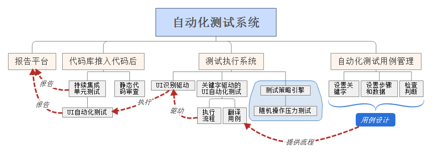
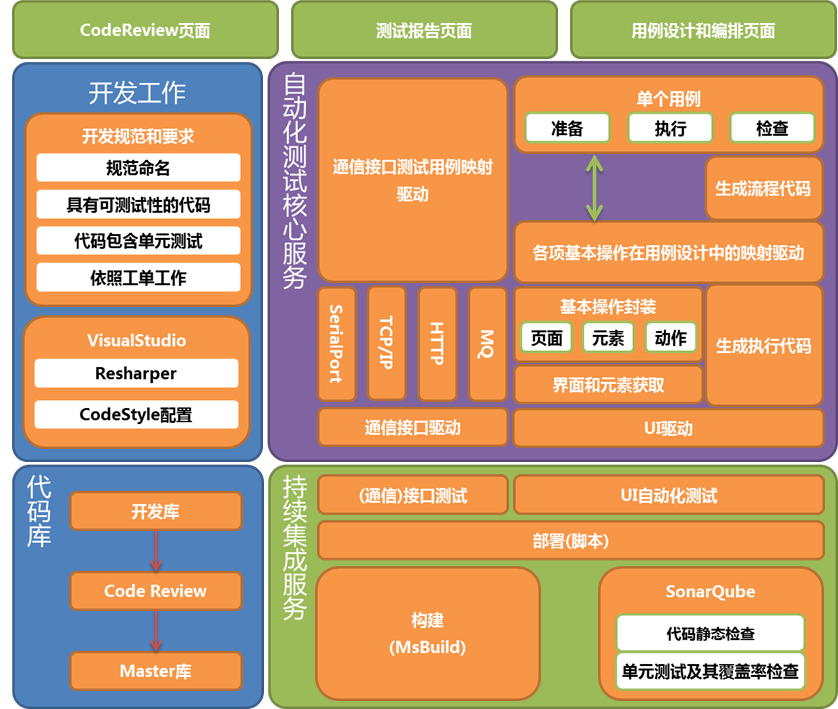

## 产品介绍
本项目是针对保证公司软件的可靠性、减少人工重复性劳动和及早发现软件修改时的问题为目的，而开展的项目。本项目预计会是一套包含从开发初期的代码自动化测试到开发完成后的用户界面流程自动化测试的综合系统。在完成本测试系统后，预计可以减少至少50%的重复测试操作。

## 需求分析
### 必须实现的需求
1. 静态代码审查
1. 持续集成
1. UI识别驱动
1. 自动化测试用例管理
1. 关键字驱动的UI自动化测试
1. 通信接口自动化测试

### 建议但非必要需求
1. 测试策略引擎
1. 随机操作破坏性测试

### 可达性评估
|原始需求|可达性|实现方案|当前状态|
|---|:---:|---|:---:|
|静态代码审查|可实现|使用SonarCube和Reshaper做静态审查，仍需和代码库进行关联|一定基础|
|持续集成|可实现|可以使用Jenkins或者TeamCity进行持续集成，仍需和代码库进行 关联和编制脚本，此项配合静态代码审查和单元测试使用|未实现|
|UI识别驱动|可实现|可以使用Ranorex为基础编写UI识别，需要做一些封装以便于使用|未实现|
|自动化测试用例管理|可实现|自行编制或找支持外部调用的测试用例管理工具|未实现|
|关键字驱动的UI自动化测试|有难度|将用例通过软件转化为操作序列，使用封装的Ranorex识别UI上的内容 并进行操作、判断和显示结果|未实现|
|通信接口的自动化测试|可实现|通过C#、python或者node.js编制通信接口的模拟程序来模拟对应的接口|一定基础|
|测试策略引擎|比较困难|通过界面关键字和测试需求，根据测试策略生成测试用例，需要一定的语义识别和 流程图识别的开发工作|未实现|
|随机操作破坏性测试|有困难|需要在切换页面后获取页面所有元素及其属性，根据可执行的操作进行执行操作， 比前面的测试多了自动生成关键字的部分|未实现|

### 需求关联性分析

## 产品规格
### 研发成果
1. 在编写代码时，可以实时进行代码静态检查。
1. 在代码推入数据库后，对代码自动构建，可以自动对代码间的配合进行静态检查。 同时执行代码中的单元测试，确认各个模块之间是否有互相影响。
1. 在编写了测试用例后就可以根据用例自动执行测试工作，因此部分测试工作可以交给机器执行。
1. 可以在软件回归测试时，减少至少50%的重复工作，并且在软件BUG修正后可以自动对修改内容的正确性进行检查，加快了反馈的速度。 
1. 需要进行通信接口测试时，可以简单的使用对应的模拟程序或者模拟设备，完成设备的模拟和测试工作。

### 产品功能汇总
参考: [必须实现的需求](#必须实现的需求) 和 [建议但非必要需求](#建议但非必要需求)

## 技术可行性分析
### 整体方案概述
系统架构图如下所示:

#### 各个模块介绍
1. 界面呈现，包括三个部分
    * CodeReview:人工代码审查
    * 用例设计和编排页面:编制自动化测试用例
    * 测试报告页面:各个项目的各个分支最新的自动化测试结果、代码静态审查结果。
1. 开发工作
    * 在开发时根据规范进行开发，可以保证代码的初步质量。
    * 在开发过程中使用Resharper导入CodeStyle配置，来实时反馈代码有问题的地方，促进修改。
1. 代码库
    * 将开发的代码进行管理的库
    * 在将代码推送到库中时，就可以在代码审查工具上进行代码审查
    * 代码审查没有问题后，就可以推送到master库中，作为发布之用。
1. 持续集成服务
    * 在代码推入开发库中后，持续集成服务通过**持续集成脚本**自动执行。
    * 首先通过MsBuild对代码进行构建，通过SonarQube执行代码静态检查和单元测试，给出测试结果。
    * 然后通过**部署脚本**将程序部署到测试机上，并运行起来。
    * 按照自动化测试用例通过**自动化测试核心服务**驱动执行自动化测试工作，包括UI自动化测试和(通信)接口自动化测试。
1. 自动化测试核心服务
    1. UI驱动:将界面的各类操作变为可以用代码控制的驱动
    1. 界面元素获取:取得当前测试软件界面各个元素的执行方法，并生成**基本操作**代码。
    1. 各项基本操作在用例设计中的映射驱动:将自然的语言和软件基本操作代码进行映射。
    1. 单个用例:每个用例必须包含的基本操作项。
    1. 生成流程代码:根据所有编排的用例，生成总体执行流程。
    1. 生成执行代码:通过映射驱动和流程代码，映射出可执行的操作代码。
    1. 最终通过UI驱动执行各项操作，并记录结果。
1. 通信接口模拟测试
    * 通信接口驱动:模拟实现各类通信的接口，可以根据上层的配置执行相关数据流输出和输入判断。
    * 通信接口测试用例映射驱动:将测试用例翻译成通信接口驱动可以识别的代码并执行。

### 技术路线
1. 本系统主要目的
    * 在测试过程中减少重复性的手工测试工作，在进行人工测试时，难免出现错、漏问题，使用机器执行则可以完全避免这方面的问题。
    * 并且在回归测试时，可以更高效的反馈修改是否合格，缩短了开发和测试之间的响应时间。
1. 技术发展路线
    1. 完成初步的单计算机纯软件自动化测试:该系统只能完成只涉及软件的部分进行自动化测试，并对部分可以使用软件模拟的接口进行测试。
    1. 全部接口的模拟测试:对于所有外部接口进行模拟，实现和设备分离的状态下模拟设备执行测试。在该阶段，可以完成大部分功能的测试工作，此时需要自行设计一款控制卡进行外部接口的仿真工作。在该阶段可以考虑将软件升级，所有工作都使用TCP/IP协议和控制卡通信，由控制卡负责所有的外部设备通信工作，并且由此来实现所有销售设备状态统一网络管理的功能。
    1. 结合设备的自动化测试系统。

## 关键技术与难点分析
### 开发工作中的关键技术
1. 具有可测试性的代码
    * 在进行开发时，如果不注意代码的可测试性，单元测试就无法实施，这样的话，软件内部质量的保证就无从谈起了，因此需要开发人员根据培训资料学习如何编制可测试性的代码。
1. 根据工单工作
    * 在开发时所有开发活动都应该是有据可循的，依据工单进行相关开发工作，并且开发的结果也记入工单之中，测试相关工作也记入工单中。这样才能保证每条代码都是经过了充分的测试，没有遗漏的情况发生。

### 代码库的选择
对于代码库的使用有两个方案:
1. SVN方式管理
1. Git方式管理
这两种代码库都能够达到代码管理的要求，相关差异如下:

|代码库类型|SVN|Git|
|---|---|---|
|软件厂家|VisualSVN|Linus Torvalds(个人)和社区|
|软件类型|免费(高级功能收费)|开源免费|
|主要差异|使用不同目录的形式管理分支，服务器集中式管理|使用分支切换的方式管理分支，服务器和个人电脑分布式管理|
|使用习惯和难易|习惯/简单(因为没有用工作流)|没用过/较复杂(高级操作要使用命令行)|
|持续集成支持|支持|支持|
|工作管理|使用第三方软件如“**禅道**”|自带(Gitea)|
|工作流|简单三库管理工作流|可以使用三库工作流也可以增加发布和热更新流程|
|代码评审方式|使用第三方软件如“**FishEye**”|自带(Gitea)|
|是否禁止未经评审代码推入主库|不禁止|可以设置保护分支禁止未经评审的代码推入|
|趋势|正在被Git代替|主流代码库管理方式|
|**进度比较**|无需学习成本直接使用|需要一定学习成本，预计多3天进行切换|
|**预算比较**|无差异|无差异|
|**风险比较**|无风险|有不会用和用不好的风险|

### 持续集成服务
对于持续集成服务，目前有三个方案:
1. Jenkins
1. TeamCity
1. VisualStudio Team Service

|持续集成软件|Jenkins|TeamCity|VS Team Service|
|---|---|---|---|
|软件厂家|开源社区|JetBrain|微软|
|软件类型|开源免费|5人团队免费|收费(较高)|
|使用难度|需要写脚本|有VS客户端较简单|和VS集成度最好|
|功能|界面一般|界面友好配置简单|界面友好|
|**进度比较**|需要一定时间学习API和编写脚本(3-5天)|需要编写脚本也可能可以使用客户端操作(2-3天)|无需编写脚本但部署较麻烦(2-3天)|
|**预算比较**|免费|暂时不会收费|费用高|
|**风险比较**|脚本调试时间过长|脚本调试时间过长|服务器可能带不动需要增加配置|

### UI驱动
在本自动化测试系统中，UI驱动是一个关键的技术，由于目前Web技术是大势所趋，所以相对于桌面软件的UI自动化测试也相对较少

|UI驱动|QTP|Ranorex|Selenium|
|---|---|---|---|
|软件厂家|惠普|Ranorex|开源|
|软件类型|收费价格高|收费价格便宜|免费|
|功能|功能全面，需要有学习成本|测试代码为C#，与现在开发语言相通|可以使用各种主流开发语言，只支持WEB测试|
|学习资源|一般|少|大量|
|**进度比较**|不确定|需要进行大量系统的开发工作，预计2到3个月时间|需要开发使用CEF(界面用HTML和JavaScript)做界面， 自动化测试系统开发较少预计15到30天左右|
|**预算比较**|10000USD|25000RMB|免费|
|**风险比较**|二次开发可能不顺利|如果使用破解版有版权风险， 测试系统全新开发有失败的风险|开发人员需要学习Web相关知识， 暂时会影响开发工作|

### 基本操作封装和各项基本操作在用例设计中的映射驱动
这两项功能虽然不是关键技术，但也需要大量的开发工作(见 [UI驱动](#UI驱动) )，将UI驱动封装成易于映射到用例上的形式。目前计划封装方法为Page.Element.Action()的形式。然后通过用例和基本操作的映射驱动进行映射。最后通过UI驱动执行所有的测试动作。
> 该功能已有其他软件实现，但使用的是Selenium WebDriver(元素识别用)和Java技术栈，与目前公司使用的WPF不兼容，如果开发学习HTML、CSS和JavaScript并改用CEF(Chromium Embeddable Framework)做界面，则有很大可能性可以直接使用其他人已实现的自动化测试系统，只需要将后台和界面交互数据导入浏览器即可进行相应的自动化测试。

### 通信接口驱动

|接口测试驱动方式|客户端/服务器软件|树莓派+控制软件|
|---|---|---|
|功能|通过客户端实现串口等通信测试，通过 服务器端实现网口类通信测试|在树莓派板卡实现服务，通过树莓派 的GPIO和网口处理各类通信业务|
|主要差异|纯软件实现，需要服务器(TCP/IP相关测试)和客户端两部分|单独板卡，使用时连接相关线路|
|优势|使用快捷，无需连接线路|使用物理连接，模拟准确。板卡有机会作为机床设备的物联网设备 使用，用例实时获取机床状态|
|劣势|需要配合服务器和单机软件|有一定材料成本，使用时需要连接线路，板卡软件编写只能使用 python、C++或JavaScript(Node.js)|
|**进度比较**|时间相对较短预计1-1.5个月|时间相对较长预计1.5-2个月|
|**预算比较**|只有开发时间无其他材料购买|除开发时间外有板卡及周边材料成本约800元左右(注解1)|
|**风险比较**|缺少资料，需要自行开发相关协议。公司使用的协议和 标准协议不兼容|同CS软件风险，另外若必须使用 JavaScript，语言特性学习时间过长|

> 注解1: 树莓派269；电源(NES-25-5):100；显示屏:350；亚克力外壳:约50(需要专门设计加工)

## 方案比较
由于预算可以从进度上较为直观的确认，所以预算部分略过。对于通信接口驱动部分由于比较独立，所以参考[通信接口驱动](#通信接口驱动)章节即可。

|方案|说明|进度比较|风险比较|
|---|---|---|---|
|Git(Gitea)+Jenkins+Ranorex+ 自行开发测试系统|费用较低，有一定学习成本， 需开发完整的测试系统|2-3个月|有一定风险，系统开发问题 可能会引起项目延误|
|Git(Gitea)+Jenkins+更换CEF栈+ 已实现的自动化测试系统|费用较低，**开发人员有较多学习成本**， 测试系统只需进行少量二次开发|1-2个月|直接使用已有系统， 系统开发风险较低|
|SVN+FishEye+禅道+Jenkins+Ranorex+ 自行开发测试系统|学习成本低，**代码、审查和项目管理分散**， 需开发完整的测试系统|2-3个月|有一定风险， 系统开发问题可能会引起项目延误|
