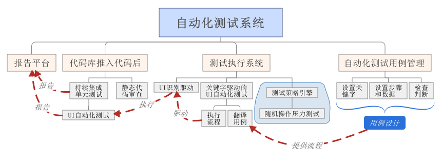

## 产品介绍
本项目是针对保证公司软件的可靠性、减少人工重复性劳动和及早发现软件修改时的问题为目的，而开展的项目。本项目预计会是一套包含从开发初期的代码自动化测试到开发完成后的用户界面流程自动化测试的综合系统。在完成本测试系统后，预计可以减少至少50%的重复测试操作。

## 需求分析
### 必须实现的需求
1. 静态代码审查
1. 持续集成
1. 单元测试方法培训资料
1. UI识别驱动
1. 自动化测试用例管理
1. 关键字驱动的UI自动化测试

### 建议但非必要需求
1. 实施单元测试
1. 测试策略引擎
1. 随机操作压力测试
1. 全部代码人工评审

### 可达性评估
|原始需求|可达性|实现方案|当前状态|
|---|:---:|---|:---:|
|静态代码审查|可实现|使用SonarCube和Reshaper做静态审查，仍需和代码库进行关联|一定基础|
|持续集成|可实现|可以使用Jenkins或者TeamCity进行持续集成，仍需和代码库进行 关联和编制脚本，此项配合静态代码审查和单元测试使用|未实现|
|单元测试方法培训资料|可实现|已编写完成主体部分，可以给开发人员学习和反馈|一定基础|
|UI识别驱动|可实现|可以使用Ranorex为基础编写UI识别，需要做一些封装以便于使用|未实现|
|自动化测试用例管理|可实现|自行编制或找支持外部调用的测试用例管理工具|未实现|
|关键字驱动的UI自动化测试|有难度|将用例通过软件转化为操作序列，使用封装的Ranorex识别UI上的内容 并进行操作、判断和显示结果|未实现|
|实施单元测试|有前提|需要开发人员学习单元测试方法，并在部分项目上实验性实施|未实现|
|全部代码人工评审|有前提|每天需要安排1小时进行代码评审，通过git中的合并请求和各自的功能分支来实现|未实现|
|测试策略引擎|比较困难|通过界面关键字和测试需求，根据测试策略生成测试用例，需要一定的语义识别和 流程图识别的开发工作|未实现|
|随机操作压力测试|有困难|需要在切换页面后获取页面所有元素及其属性，根据可执行的操作进行执行操作， 比前面的测试多了自动生成关键字的部分|未实现|

### 需求关联性分析

## 产品规格
### 研发成果

### 产品功能汇总

## 技术可行性分析
### 技术现状概述

### 技术路线

### 关键技术与难点分析

### 进度比较分析

### 预算比较分析

### 风险比较分析